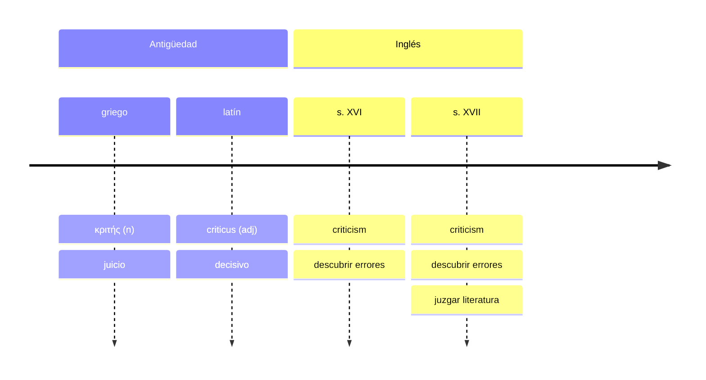
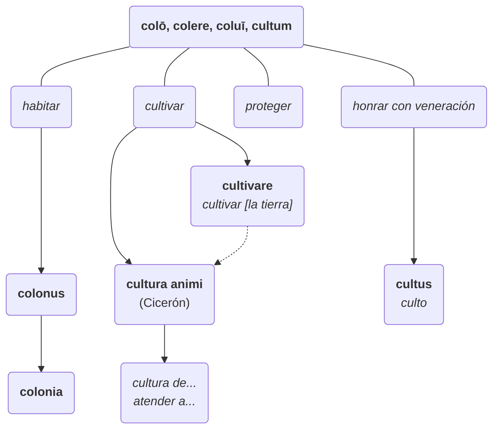
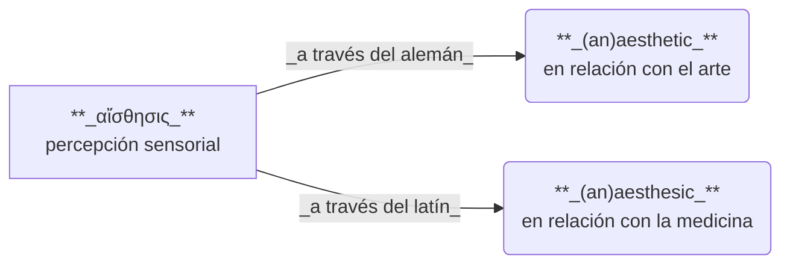
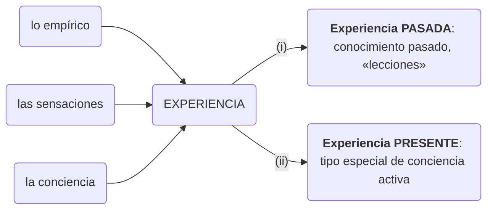
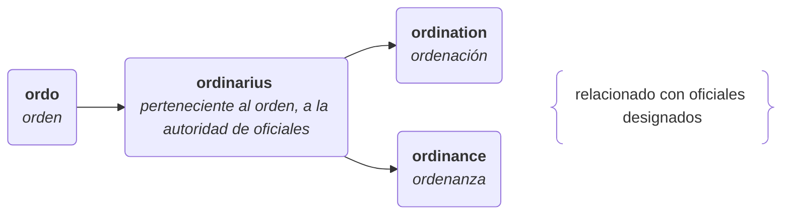
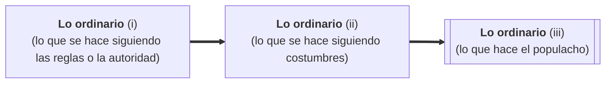

# Introducción

## Desde el fin de la guerra hasta *Culture and Society* (pp. 15-18)

> No hay ningún criterio lingüístico que establezca que, por sí solo, un grupo está «equivocado», pero **es posible que un grupo temporalmente dominante trate de imponer sus propios usos como correctos;** en un período de cambio importante, dicho proceso puede parecer inusualmente acelerado y consciente (por ejemplo, durante la Segunda Guerra Mundial, tras la cual Williams identifica un cambio en el significado de la palabra «cultura»).

> **Me preocupaba una única palabra, *cultura*,** que parecía escucharse con mucho más frecuencia. Anteriormente, yo la había escuchado en dos sentidos: como una especie de superioridad social («tener cultura», «hombre de cultura») o como una palabra activa para escribir poemas y novelas, hacer películas y pinturas y trabajar en teatros. **Lo que ahora escuchaba eran dos sentidos diferentes: primero, como una formación fundamental de valores; segundo, un uso que la hacía casi equivalente a *sociedad*: un *modo de vida* particular** (la cultura norteamericana, la cultura japonesa).

1948: publicación de *Notas para la definición de cultura*, de T. S. Eliot. 

> Un libro que yo comprendí pero no pude aceptar. 

> Los cambios de sentido que yo trataba de entender habían comenzado en inglés a principios del siglo XIX, y figuran en diccionarios históricos de la lengua. 

A partir de la relación histórica entre las palabras *cultura*, *clase*, *arte*, *industria* y *democracia*, Williams traza una tradición: el estudio de esa tradición terminará siendo, en 1956, *Culture and Society*. 

## Categorías académicas y sus conexiones históricas

> Los temas académicos no son categorías eternas. 

Los términos adquieren una dimensión problemática cuando son empleadas en áreas de estudio separadas: palabras como *cultura*, *arte* y *trabajo*, cuando aparecen de forma independiente y autónoma en dos campos como las artes y la sociología, enriquecen su carga semántica a partir de las conexiones que sugieren.

> ==La significación, puede decirse, está en la selección.==

(Esta frase puede referirse tanto a la selección de términos para el libro, como a la selección de palabras específicas en ciertos campos en lugar de otras, apelando precisamente a esas conexiones con otras áreas que otras palabras quizás no tengan). 

## *Keywords*

*Palabras clave* originalmente estaba incluido en el manuscrito de *Cultura y sociedad* como un apéndice. 

> No es un diccionario ni un glosario de un tema académico en particular. No es una serie de notas a pie de página \[…]. Se trata, antes bien, del registro de una investigación sobre un *vocabulario*: ==un cuerpo compartido de palabras y significados== en nuestras discusiones más generales, en inglés, sobre las prácticas e instituciones que agrupamos como ***cultura y sociedad***.

> Los problemas planteados por \[los significados de estas palabras] me parecían inextricablemente ligados a los problemas para cuya discusión se utilizaba. 

# ARTE \[*ART*]

Primero, el arte como destreza: 

> En los programas universitarios medievales, las artes (las «siete artes» y más tardes las «artes liberales») abarcaban desde matemática hasta pesca con caña. 

> Antes del siglo XVII, **sin arte** \[*artless*] significaba «inhábil», «carente de destrezas». 

Especialización del término:

> Desde fines del siglo XVII, hubo una aplicación especializada cada vez más común a un conjunto específico de destrezas: **la pintura, el dibujo, el grabado y la escultura**. 
>
> Se fortaleció y popularizó la distinción hoy general entre **artistas y artesanos**: el artesano es un «trabajador manual calificado», sin propósitos «intelectuales», «imaginativos», «creativos». Este desarrollo de **artesano** y la distinción con *científico* a mediados del s. XIX permitieron la especialización de **artista**, y la distinción, ya no de las artes *liberales*, sino de las **bellas artes**.

Arte abstracto y con mayúscula:

> El concepto recién se hizo general en el s. XIX. Wordsworth (1815): «elevada es nuestra vocación: el Arte Creativo». De esta misma época viene la asociación entre **arte** y *creatividad* e *imaginación*; en este siglo surge el adjetivo **artístico**, y la noción de **sensibilidad artística**

# CRÍTICA \[*CRITICISM*]

Desde su concepción, la palabra *crítica* se vincula a un **juicio negativo**, mientras que *apreciación* se utiliza como término más neutro. 
# COMUNIDAD \[*COMMUNITY*]
# CULTURA \[*CULTURE*]

> **Cultura** es ==una de las dos o tres palabras más complicadas de la lengua inglesa.==

En el s. XVIII, **cultura** estaba asociado a la clase baja, por analogía con **cultivo** y **cultivado**, y no aparece todavía como sustantivo abstracto independiente. El sentido contemporáneo es expresado por la palabra *civilidad*, y no comienza a desarrollarse hasta el s. XIX

Wordsworth, 1805 

> …where grace of **culture** hath been utterly unknown.
> 
> _(…donde la gracia de la **cultura** era totalmente desconocido.)_

Emma, 1816

> …every advantage of discipline and **culture**.
> 
> _(toda ventaja de la disciplina y de la **cultura**.)_

Alemania, ss. XVIII-XIX: **Kultur**, _progreso secular_.

==Herder, 1791==

> Nada es más indeterminado que esta palabra, y nada más engañoso que su aplicación a todas las naciones y todos los períodos.
>  
> La mera noción de una cultura europea superior es un insulto flagrante a la majestad de la Naturaleza.

# DETERMINAR \[*DETERMINE*]
# ESTÉTICO \[_AESTHETIC_]

Coleridge, 1821: hay que encontrar una palabra menos pedante que «estética» para «las cosas del **gusto** y de la **crítica**».

La categoría de «estética» refleja la relación de la sociedad contemporánea con el arte, que simula ser individual y subjetiva.
# EXPERIENCIA \[EXPERIENCE]

La historia de **experiencia** está signada por el desarrollo de **empírico** y de su importancia en la filosofía a partir del s. XVIII, así como por su relación con *experimento* y *experimentar*. Tiene dos significados principales, que podemos distinguir como **«experience past»** y **«experience present»**:
1. conocimiento del pasado («lecciones de experiencia») de la cual se pueden sacar conclusiones, o;
2. **experimentación**, tipo particular de conciencia, más plena, que combina sensación/percepción y pensamiento, y que suele ser privilegiada por sobre otros actos de conciencia menores (opiniones, razonamientos ideales).

El primero de los significados prevalece en la historia y la política; el segundo emerge de la teología y es fundamental en el campo de la **[[Williams (1976). Keywords (Palabras clave)#ESTÉTICO [_AESTHETIC_]|estética]]**. 

# IDEOLOGÍA \[*IDEOLOGY*]
# LITERATURA \[*LITERATURE*]
# ORDINARIO \[*ORDINARY*]

A partir del s. XVIII, la relación entre lo «ordinario» y lo «acostumbrado» genera un tono de superioridad, una división cada vez más evidente entre la «gente ordinaria» (inculta, ignorante) y la «gente **[[Williams (1976). Keywords (Palabras clave)#SENSIBILIDAD [*SENSIBILITY*|sensible]]**», «decente», «normal», etcétera. (Ver **[[Williams (1976). Keywords (Palabras clave)#POPULAR [*POPULAR*|POPULAR]]**).

# POPULAR \[*POPULAR*]

*popularis* (perteneciente al pueblo)

**Popular** es desde su raíz latina un término político, pero inicialmente neutro. A partir del s. XVII adquiere una connotación negativa, una perspectiva «de arriba abajo». **Popularidad** es, en 1697, «buscar el favor del pueblo mediante prácticas indebidas». 

A partir del s. XIX comienza a darse un movimiento hacia el sentido opuesto, una perspectiva «desde el pueblo», «del pueblo». Así, **popular**, **populismo** y **popularidad** tienen dos significados, dependiendo de su perspectiva:
- externa y negativa, con una idea de inferioridad, como en **literatura popular**, **cultura popular**;
- interna y positiva o neutra, con el sentido de «favorito», «común», «muy apreciado». 
# SENSIBILIDAD \[*SENSIBILITY*]